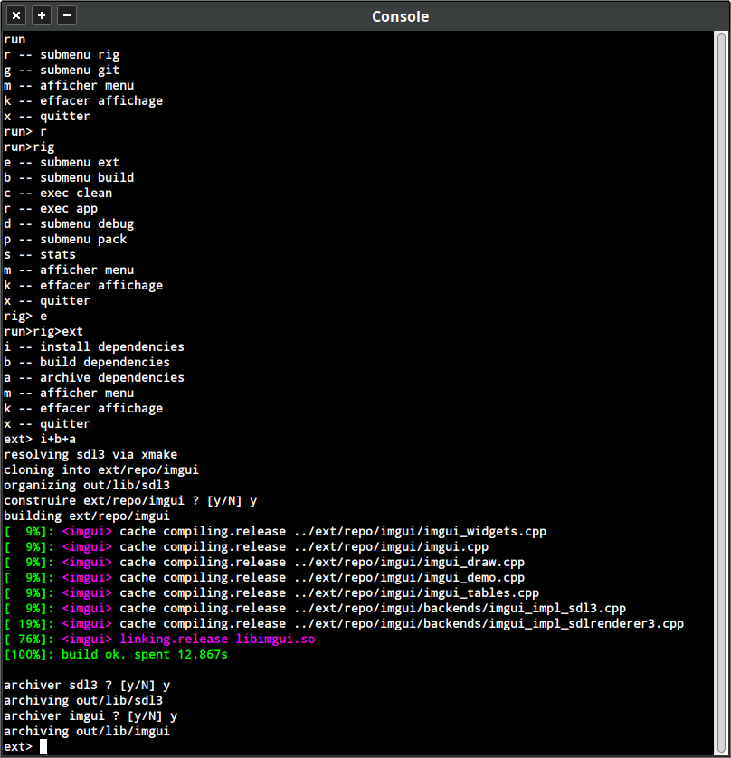
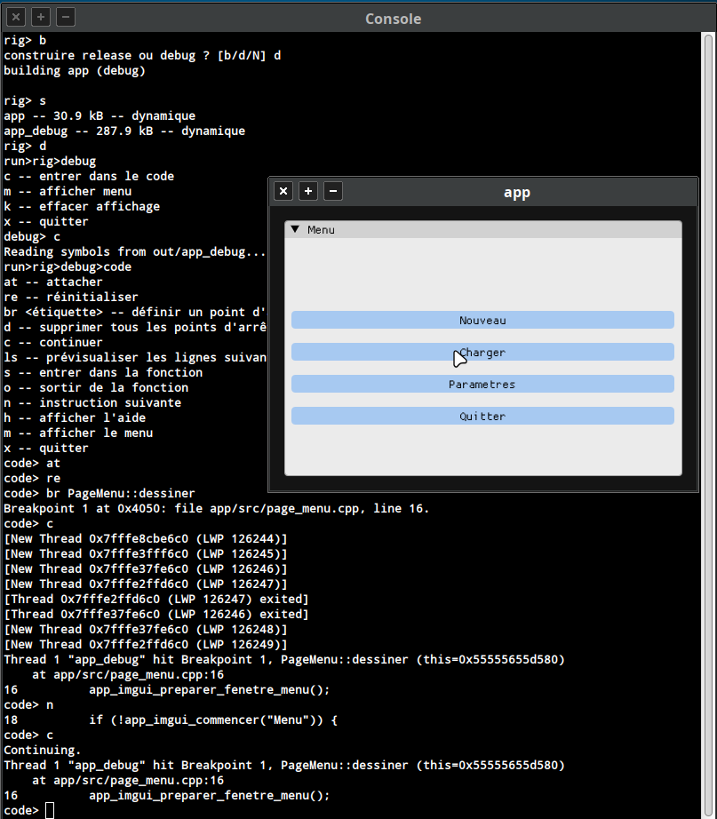
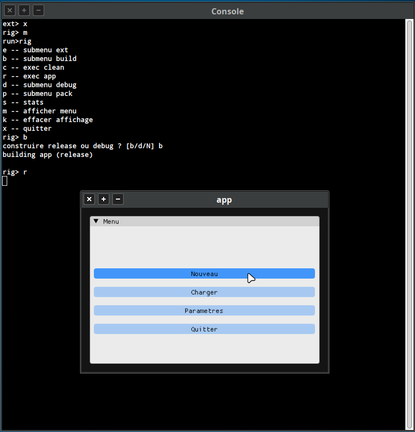
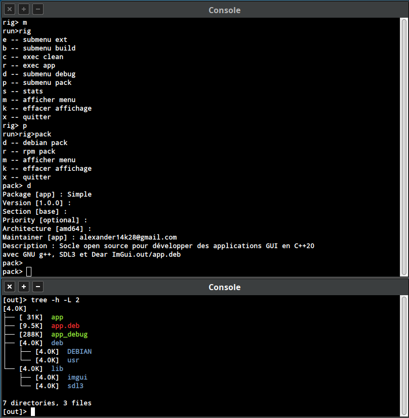
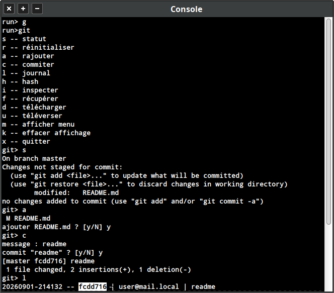
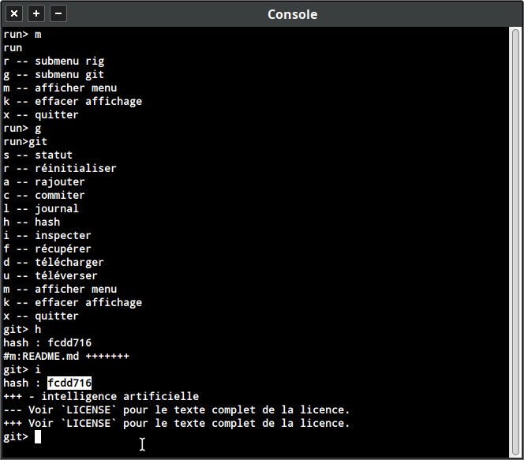
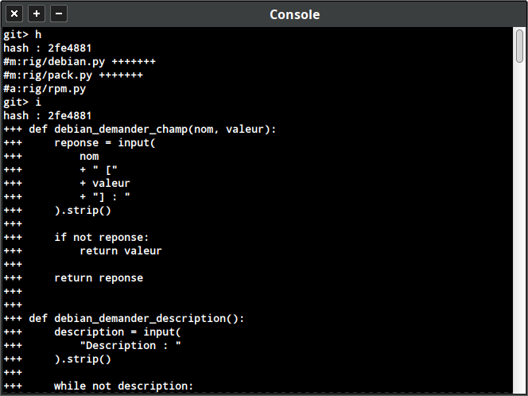
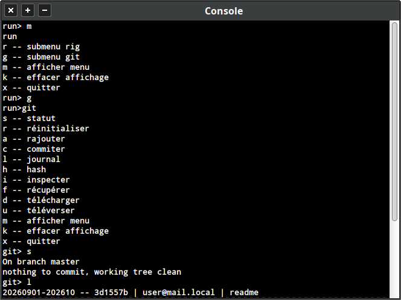

# Simple
Socle open source pour développer des applications GUI en C++20 <br>avec GNU g++, SDL3 et Dear ImGui.

L'objectif est de fournir une base simple et légère pour démarrer<br>
rapidement un projet graphique sans imposer une architecture lourde.

## Fonctionnalités

- Interface graphique avec SDL3 et Dear ImGui
- Compilation C++20 avec GNU g++
- Builds release et debug
- Gestion des dépendances avec Xmake
- Outils de développement et de débogage
- Journalisation
- Création de paquets Debian, RPM et Windows
- Gestion des bibliothèques nécessaires à l'application
- Architecture prévue pour évoluer vers d'autres plateformes

## Possibilités

Le projet peut servir de base pour :

- applications desktop
- utilitaires graphiques
- outils internes
- prototypes GUI
- petits jeux
- projets expérimentaux C++ open source
- intelligence artificielle

Il peut évoluer avec d'autres plateformes, systèmes de packaging et outils
de développement.

## Objectif

Aider la communauté open source à développer plus facilement des
applications GUI avec C++ et des outils libres.

Le projet s'appuie sur GNU g++, SDL3 et Dear ImGui afin de fournir une base
accessible et réutilisable.

## Contenu
```text
.
├── app/              -- application client
├── doc/              -- ressources documentaires
├── ext/              -- dépendances externes
├── out/              -- livrables de compilation
├── rig/              -- scripts de construction
├── README.md         -- ce fichier
├── LICENSE           -- licence
├── run.bat           -- démarrer run.py sous Windows
├── run.sh            -- démarrer run.py sous Linux/macOS
└── run.py            -- point d'entrée pour la construction
```

## Dépendances

- GNU g++
- SDL3
- Dear ImGui
- Xmake

Les composants tiers conservent leurs propres licences et notices.

## Utilisation

Exécuter run.sh sour Linux Mint Xfce<br>
puis construction des dépendances externes:<br>
<div style="text-align: center;">
  
</div>

puis construction de l'application client en mode développement:<br>
<div style="text-align: center;">
  
</div>

puis construction de l'application client en mode production:<br>
<div style="text-align: center;">
  
</div>

puis construction d'un pack de livraison pour Debian/Ubuntu:<br>
<div style="text-align: center;">
  
</div>

puis la sauvegarde des travaux avec git:<br>
<div style="text-align: center;">
  
</div>

puis l'inspection des travaux collaboratifs avec git:<br>
<div style="text-align: center;">
  
</div>

et l'inspection détaillée:<br>
<div style="text-align: center;">
  
</div>

et l'historique des travaux:<br>
<div style="text-align: center;">
  
</div>

## Tests sur Windows

- à déterminer

## Tests sur MacOs 

- à déterminer

## License

This project is licensed under the BSD 3-Clause License - see the LICENSE
file for details.

Copyright (c) 2026 alexander14k28@gmail.com

See [LICENSE](LICENSE) for the license governing this project.
